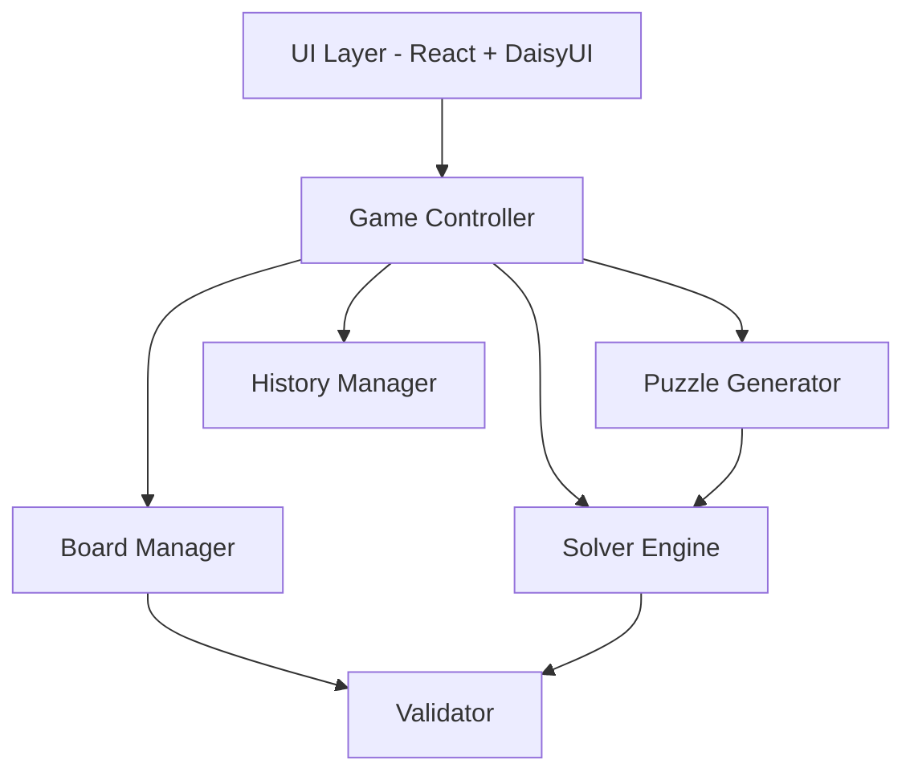
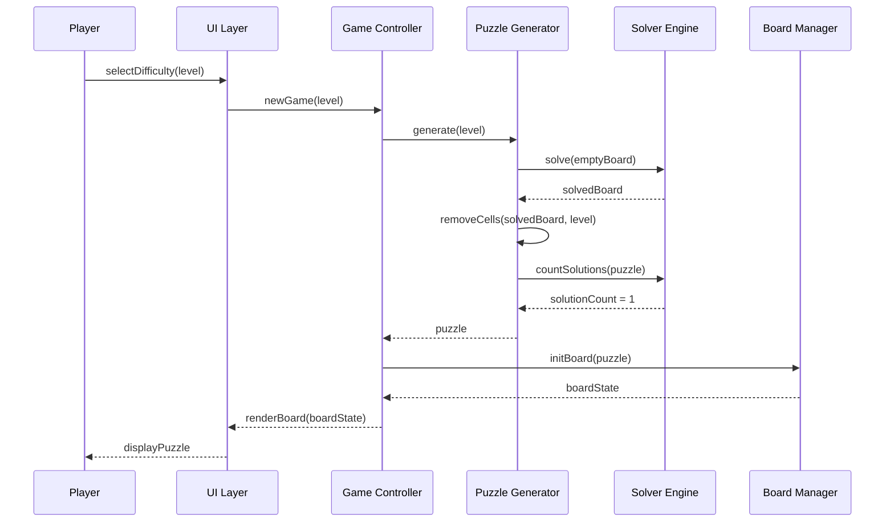
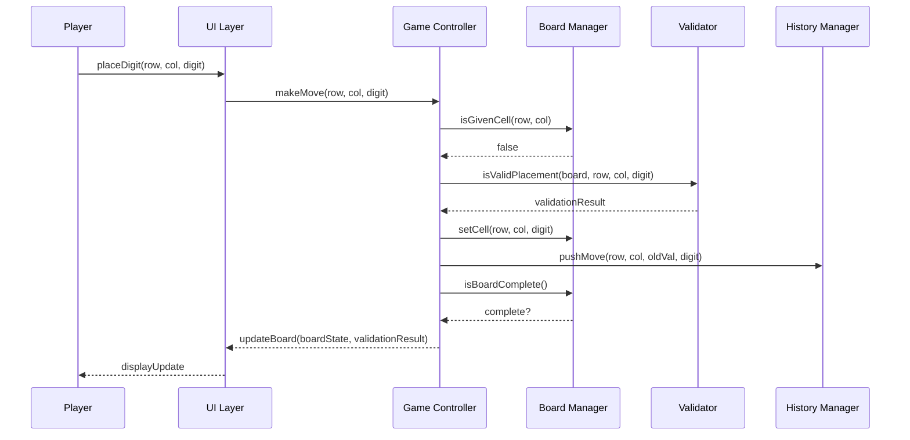

# Design Document: Sudoku Game

## Overview

This document describes the design of a Sudoku puzzle game that allows players to generate, play, and solve standard 9×9 Sudoku puzzles. The game supports puzzle generation at multiple difficulty levels, real-time validation of player moves, pencil marks (candidate tracking), undo/redo functionality, and an automatic solver for hints or full solutions.

The core engine is built around constraint propagation and backtracking search, two well-established techniques for Sudoku solving. Puzzle generation works by producing a fully solved board and then strategically removing cells while ensuring the puzzle retains a unique solution. The architecture cleanly separates the game logic (board state, validation, solving) from the UI layer, enabling portability across different frontends.

The implementation uses TypeScript throughout for type safety and developer ergonomics. The UI is built with React and styled using DaisyUI (a Tailwind CSS component library), providing a clean, themeable interface with minimal custom CSS. Key properties such as board validity, solution uniqueness, and move legality are expressed as typed invariants that guide implementation and testing.

## Architecture



The system is organized into six core components:

- **UI Layer**: React components styled with DaisyUI/Tailwind CSS. Renders the board, accepts player input, displays feedback.
- **Game Controller**: Orchestrates game flow, delegates to subsystems.
- **Board Manager**: Owns the immutable board state, produces new states on moves.
- **Solver Engine**: Implements constraint propagation + backtracking.
- **Puzzle Generator**: Creates puzzles with unique solutions at varying difficulty.
- **History Manager**: Tracks moves for undo/redo.
- **Validator**: Checks row, column, and box constraints.

## Sequence Diagrams

### New Game Flow



### Player Move Flow



## Components and Interfaces

### Component 1: Board Manager

**Purpose**: Manages the 9×9 grid state, distinguishing given (fixed) cells from player-filled cells.

```typescript
type Digit = 1 | 2 | 3 | 4 | 5 | 6 | 7 | 8 | 9;

interface Cell {
  value: Digit | null;       // null = empty
  isGiven: boolean;          // true if part of original puzzle
  pencilMarks: Set<Digit>;   // candidate digits noted by player
}

type Board = Cell[][];       // 9×9 grid, Board[row][col]

interface BoardManager {
  initBoard(puzzle: (Digit | null)[][]): Board;
  getCell(board: Board, row: number, col: number): Cell;
  setCell(board: Board, row: number, col: number, digit: Digit): Board;
  clearCell(board: Board, row: number, col: number): Board;
  isGivenCell(board: Board, row: number, col: number): boolean;
  togglePencilMark(board: Board, row: number, col: number, digit: Digit): Board;
  isBoardComplete(board: Board): boolean;
  getEmptyCells(board: Board): [number, number][];
}
```

**Responsibilities**:

- Store and retrieve cell values
- Enforce immutability of given cells
- Track pencil marks per cell
- Report board completeness

### Component 2: Validator

**Purpose**: Checks Sudoku constraints (rows, columns, 3×3 boxes) for individual placements and full board validity.

```typescript
type ValidationResult =
  | { kind: "valid" }
  | { kind: "conflict"; conflicts: [number, number][] };

interface Validator {
  isValidPlacement(board: Board, row: number, col: number, digit: Digit): ValidationResult;
  isRowValid(board: Board, row: number): boolean;
  isColValid(board: Board, col: number): boolean;
  isBoxValid(board: Board, boxRow: number, boxCol: number): boolean;
  isBoardValid(board: Board): boolean;
  getConflicts(board: Board, row: number, col: number, digit: Digit): [number, number][];
}
```

**Responsibilities**:

- Validate individual digit placements against row/col/box
- Return conflicting cell positions for UI highlighting
- Validate entire board state

### Component 3: Solver Engine

**Purpose**: Solves Sudoku puzzles using constraint propagation and backtracking. Also counts solutions to verify uniqueness.

```typescript
type SolveResult =
  | { kind: "solved"; board: Board }
  | { kind: "noSolution" }
  | { kind: "multipleSolutions" };

interface Solver {
  solve(board: Board): SolveResult;
  countSolutions(board: Board, limit?: number): number;
  getHint(board: Board): { row: number; col: number; digit: Digit } | null;
  getCandidates(board: Board, row: number, col: number): Set<Digit>;
}
```

**Responsibilities**:

- Solve puzzles via constraint propagation + backtracking
- Count solutions up to a limit (for uniqueness checking)
- Provide single-cell hints to the player
- Compute candidate sets for empty cells

### Component 4: Puzzle Generator

**Purpose**: Generates Sudoku puzzles with a unique solution at a specified difficulty level.

```typescript
enum Difficulty {
  Easy = "easy",       // ~35-40 givens
  Medium = "medium",   // ~28-34 givens
  Hard = "hard",       // ~22-27 givens
  Expert = "expert",   // ~17-21 givens
}

interface PuzzleGenerator {
  generate(difficulty: Difficulty, seed?: number): Board;
  estimateDifficulty(board: Board): Difficulty;
}
```

**Responsibilities**:

- Generate a fully solved board
- Remove cells according to difficulty while preserving unique solvability
- Optionally accept a seed for reproducible generation

### Component 5: History Manager

**Purpose**: Tracks player actions for undo/redo support.

```typescript
interface Move {
  row: number;
  col: number;
  oldValue: Digit | null;
  newValue: Digit | null;
  oldPencilMarks: Set<Digit>;
  newPencilMarks: Set<Digit>;
}

interface History {
  undoStack: Move[];
  redoStack: Move[];
}

interface HistoryManager {
  pushMove(history: History, move: Move): History;
  undo(history: History): { move: Move; history: History } | null;
  redo(history: History): { move: Move; history: History } | null;
  canUndo(history: History): boolean;
  canRedo(history: History): boolean;
  clear(history: History): History;
}
```

**Responsibilities**:

- Record each player action as a reversible move
- Support undo by popping from undo stack and pushing to redo stack
- Clear redo stack when a new move is made

### Component 6: Game Controller

**Purpose**: Orchestrates game flow, connecting UI events to the appropriate subsystems.

```typescript
type GameState =
  | { kind: "menu" }
  | { kind: "playing"; board: Board; history: History; elapsed: number }
  | { kind: "paused"; board: Board; history: History; elapsed: number }
  | { kind: "completed"; board: Board; elapsed: number };

interface GameController {
  newGame(difficulty: Difficulty): GameState;
  makeMove(state: GameState, row: number, col: number, digit: Digit): { state: GameState; validation: ValidationResult };
  undoMove(state: GameState): GameState;
  redoMove(state: GameState): GameState;
  requestHint(state: GameState): { state: GameState; hint: { row: number; col: number; digit: Digit } | null };
  togglePencilMark(state: GameState, row: number, col: number, digit: Digit): GameState;
  pause(state: GameState): GameState;
  resume(state: GameState): GameState;
  checkCompletion(state: GameState): boolean;
}
```

**Responsibilities**:

- Manage game lifecycle (new game, pause, resume, completion)
- Delegate moves to Board Manager after validation
- Coordinate hint requests with Solver
- Track elapsed time

## Data Models

### Board Representation

```typescript
type Digit = 1 | 2 | 3 | 4 | 5 | 6 | 7 | 8 | 9;

interface Pos {
  row: number; // 0-8
  col: number; // 0-8
}

/** The 3×3 box a position belongs to */
function getBox(pos: Pos): { boxRow: number; boxCol: number } {
  return {
    boxRow: Math.floor(pos.row / 3),
    boxCol: Math.floor(pos.col / 3),
  };
}

/** Two positions are peers if they share a row, column, or box */
function isPeer(a: Pos, b: Pos): boolean {
  if (a.row === b.row && a.col === b.col) return false;
  if (a.row === b.row) return true;
  if (a.col === b.col) return true;
  const boxA = getBox(a);
  const boxB = getBox(b);
  return boxA.boxRow === boxB.boxRow && boxA.boxCol === boxB.boxCol;
}
```

**Validation Rules**:

- Each row contains each digit at most once
- Each column contains each digit at most once
- Each 3×3 box contains each digit at most once
- Given cells cannot be modified
- A complete board has all 81 cells filled with no constraint violations

### Game Session

```typescript
interface GameSession {
  puzzle: Board;          // original puzzle (immutable reference)
  current: Board;         // current board state
  solution: Board;        // the unique solution
  difficulty: Difficulty;
  history: History;
  elapsedSeconds: number;
  hintsUsed: number;
}
```

## Algorithmic Pseudocode

### Constraint Propagation + Backtracking Solver

```typescript
/** Candidates for a cell: digits not already in its row, column, or box */
function candidates(board: Board, pos: Pos): Set<Digit> {
  const allDigits: Set<Digit> = new Set([1, 2, 3, 4, 5, 6, 7, 8, 9]);
  const rowDigits = digitsInRow(board, pos.row);
  const colDigits = digitsInCol(board, pos.col);
  const boxDigits = digitsInBox(board, getBox(pos));

  const result = new Set(allDigits);
  for (const d of [...rowDigits, ...colDigits, ...boxDigits]) {
    result.delete(d);
  }
  return result;
}

/**
 * Propagate constraints: if any cell has exactly one candidate, fill it.
 * Repeat until no more naked singles remain.
 */
function propagate(board: Board): Board | null {
  const b = deepCloneBoard(board);
  let changed = true;

  while (changed) {
    changed = false;
    for (const pos of getEmptyCells(b)) {
      const cands = candidates(b, pos);
      if (cands.size === 0) return null; // contradiction
      if (cands.size === 1) {
        const [digit] = cands;
        b[pos.row][pos.col] = { value: digit, isGiven: false, pencilMarks: new Set() };
        changed = true;
      }
    }
  }
  return b;
}

/**
 * Solve by constraint propagation then backtracking on the cell
 * with the fewest candidates (MRV heuristic).
 */
function solve(board: Board): SolveResult {
  const propagated = propagate(board);
  if (!propagated) return { kind: "noSolution" };

  const empties = getEmptyCells(propagated);
  if (empties.length === 0) return { kind: "solved", board: propagated };

  // MRV: pick cell with fewest candidates
  let target = empties[0];
  let minCands = candidates(propagated, target);
  for (const pos of empties) {
    const cands = candidates(propagated, pos);
    if (cands.size < minCands.size) {
      target = pos;
      minCands = cands;
    }
  }

  if (minCands.size === 0) return { kind: "noSolution" };

  for (const digit of minCands) {
    const next = deepCloneBoard(propagated);
    next[target.row][target.col] = { value: digit, isGiven: false, pencilMarks: new Set() };
    const result = solve(next);
    if (result.kind === "solved") return result;
  }

  return { kind: "noSolution" };
}

/** Count solutions up to a limit. Used to verify puzzle uniqueness. */
function countSolutions(board: Board, limit: number = 2): number {
  const propagated = propagate(board);
  if (!propagated) return 0;

  const empties = getEmptyCells(propagated);
  if (empties.length === 0) return 1;

  // MRV heuristic
  let target = empties[0];
  let minCands = candidates(propagated, target);
  for (const pos of empties) {
    const cands = candidates(propagated, pos);
    if (cands.size < minCands.size) {
      target = pos;
      minCands = cands;
    }
  }

  let count = 0;
  for (const digit of minCands) {
    const next = deepCloneBoard(propagated);
    next[target.row][target.col] = { value: digit, isGiven: false, pencilMarks: new Set() };
    count += countSolutions(next, limit - count);
    if (count >= limit) return count;
  }
  return count;
}
```

### Puzzle Generation Algorithm

```typescript
/** Generate a complete solved board by solving an empty board with randomized candidate ordering. */
function generateSolvedBoard(rng: () => number): Board {
  return solveWithRandomization(createEmptyBoard(), rng);
}

/**
 * Remove cells one at a time, checking that the puzzle retains
 * a unique solution after each removal.
 */
function removeCells(
  board: Board,
  positions: Pos[],
  targetGivens: number,
  currentGivens: number
): Board {
  const b = deepCloneBoard(board);
  let givens = currentGivens;

  for (const pos of positions) {
    if (givens <= targetGivens) break;

    const saved = b[pos.row][pos.col].value;
    b[pos.row][pos.col] = { value: null, isGiven: false, pencilMarks: new Set() };

    if (countSolutions(b, 2) === 1) {
      givens--;
    } else {
      // Removing this cell creates multiple solutions; restore it
      b[pos.row][pos.col] = { value: saved, isGiven: true, pencilMarks: new Set() };
    }
  }

  return b;
}

/** Main generation entry point. */
function generate(difficulty: Difficulty, seed?: number): Board {
  const rng = seed !== undefined ? seededRandom(seed) : Math.random;
  const solved = generateSolvedBoard(rng);
  const positions = shufflePositions(allPositions(), rng);

  const targetGivens: Record<Difficulty, number> = {
    [Difficulty.Easy]: 38,
    [Difficulty.Medium]: 30,
    [Difficulty.Hard]: 25,
    [Difficulty.Expert]: 20,
  };

  return removeCells(solved, positions, targetGivens[difficulty], 81);
}
```

## Key Functions with Formal Specifications

### Function: solve

```typescript
function solve(board: Board): SolveResult;
```

**Preconditions:**

- `board` is a valid board (no constraint violations among filled cells)
- `isBoardValid(board) === true`

**Postconditions:**

- If result is `{ kind: "solved", board: b }`, then `isBoardComplete(b) && isBoardValid(b)`
- If result is `{ kind: "solved", board: b }`, then `b` extends `board` (all given cells preserved)
- If result is `{ kind: "noSolution" }`, no valid completion of `board` exists

**Loop Invariants:**

- In the digit iteration loop: all digits tried so far led to no solution
- Board validity is maintained after each propagation step

### Function: countSolutions

```typescript
function countSolutions(board: Board, limit?: number): number;
```

**Preconditions:**

- `board` is a valid board
- `limit > 0` (defaults to 2)

**Postconditions:**

- Returns `Math.min(actualSolutionCount, limit)`
- Result ≤ `limit`
- If result === 0, no valid completion exists
- If result === 1, exactly one solution exists (unique)

**Loop Invariants:**

- `count` = number of solutions found so far from previously tried digits
- `count < limit` at loop entry (otherwise loop terminates early)

### Function: isValidPlacement

```typescript
function isValidPlacement(board: Board, row: number, col: number, digit: Digit): ValidationResult;
```

**Preconditions:**

- `row` and `col` are in range [0, 8]
- Cell at `(row, col)` is not a given cell

**Postconditions:**

- Returns `{ kind: "valid" }` iff `digit` does not conflict with any peer cell
- Returns `{ kind: "conflict", conflicts }` where `conflicts` lists all cells containing `digit` that share a row, column, or box with `(row, col)`
- `conflicts` is non-empty iff result kind is `"conflict"`

**Loop Invariants:** N/A (single-pass check over peers)

### Function: generate

```typescript
function generate(difficulty: Difficulty, seed?: number): Board;
```

**Preconditions:**

- `difficulty` is a valid `Difficulty` enum value

**Postconditions:**

- Returned board has exactly one solution (`countSolutions(result, 2) === 1`)
- Number of given cells is approximately within the target range for `difficulty`
- All given cells in the result are consistent with the unique solution

**Loop Invariants:**

- In `removeCells`: the board always has exactly one solution
- `givens` decreases by 1 on each successful removal

## UI Design with DaisyUI

The UI layer uses React with DaisyUI (Tailwind CSS component library) for consistent, themeable styling.

### Key UI Components

```typescript
// Board grid component using DaisyUI card and Tailwind grid
const SudokuBoard: React.FC<{ board: Board; onCellClick: (row: number, col: number) => void }>;

// Individual cell with DaisyUI-based styling for states
const SudokuCell: React.FC<{
  cell: Cell;
  isSelected: boolean;
  isConflict: boolean;
  isPeer: boolean;
  onClick: () => void;
}>;

// Digit input pad using DaisyUI btn components
const DigitPad: React.FC<{
  onDigit: (digit: Digit) => void;
  onClear: () => void;
  onPencilToggle: () => void;
  pencilMode: boolean;
}>;

// Game controls toolbar
const GameControls: React.FC<{
  onUndo: () => void;
  onRedo: () => void;
  onHint: () => void;
  onNewGame: () => void;
  onPause: () => void;
  canUndo: boolean;
  canRedo: boolean;
}>;

// Difficulty selector using DaisyUI dropdown/select
const DifficultySelector: React.FC<{
  onSelect: (difficulty: Difficulty) => void;
}>;

// Timer display
const Timer: React.FC<{ elapsed: number; paused: boolean }>;
```

### DaisyUI Styling Approach

- **Board container**: `card bg-base-100 shadow-xl` for the main game area
- **Cells**: `btn btn-ghost btn-square` base, with `btn-primary` for selected, `btn-error` for conflicts, `bg-base-200` for given cells
- **Digit pad**: `btn-group` with `btn btn-outline` for each digit
- **Controls**: `btn btn-sm` with appropriate DaisyUI variants (`btn-info` for hint, `btn-warning` for undo)
- **Difficulty selector**: `select select-bordered` dropdown
- **Timer**: `badge badge-lg` or `countdown` component
- **Completion modal**: `modal` with `modal-box` for win screen
- **Theme**: Leverage DaisyUI's built-in theme system (`data-theme` attribute) for light/dark mode support
- **3×3 box borders**: Thicker Tailwind borders (`border-2` vs `border`) to visually separate boxes

## Example Usage

```typescript
// Example 1: Start a new game
const controller = createGameController();
const gameState = controller.newGame(Difficulty.Medium);
// gameState is { kind: "playing", board, history, elapsed: 0 }

// Example 2: Make a move and check validity
const { state: newState, validation } = controller.makeMove(gameState, 2, 4, 7);
if (validation.kind === "conflict") {
  console.log("Conflicts at:", validation.conflicts);
}

// Example 3: Undo a move
const afterUndo = controller.undoMove(newState);

// Example 4: Request a hint
const { state: hintState, hint } = controller.requestHint(gameState);
if (hint) {
  console.log(`Try ${hint.digit} at row ${hint.row}, col ${hint.col}`);
}

// Example 5: Solve a puzzle directly
const puzzle = generate(Difficulty.Hard);
const result = solve(puzzle);
if (result.kind === "solved") {
  console.log("Solved!");
} else {
  console.log("No solution exists");
}

// Example 6: React component usage with DaisyUI
const App: React.FC = () => {
  const [gameState, setGameState] = useState<GameState>({ kind: "menu" });

  return (
    <div className="min-h-screen bg-base-200" data-theme="light">
      <div className="container mx-auto p-4">
        <div className="card bg-base-100 shadow-xl">
          <div className="card-body">
            {gameState.kind === "menu" && (
              <DifficultySelector onSelect={(d) => setGameState(controller.newGame(d))} />
            )}
            {gameState.kind === "playing" && (
              <>
                <Timer elapsed={gameState.elapsed} paused={false} />
                <SudokuBoard board={gameState.board} onCellClick={handleCellClick} />
                <DigitPad onDigit={handleDigit} onClear={handleClear} onPencilToggle={togglePencil} pencilMode={pencilMode} />
                <GameControls onUndo={handleUndo} onRedo={handleRedo} onHint={handleHint} onNewGame={handleNewGame} onPause={handlePause} canUndo={true} canRedo={false} />
              </>
            )}
          </div>
        </div>
      </div>
    </div>
  );
};
```

## Correctness Properties

The following properties should hold universally and can guide property-based testing:

```typescript
// P1: A solved board is always valid
// ∀ board: Board, solve(board).kind === "solved" ⟹ isBoardValid(solve(board).board) === true
function prop_solvedBoardValid(board: Board): boolean {
  const result = solve(board);
  if (result.kind === "solved") {
    return isBoardValid(result.board);
  }
  return true; // vacuously true if not solved
}

// P2: A solved board is always complete
// ∀ board: Board, solve(board).kind === "solved" ⟹ isBoardComplete(solve(board).board) === true
function prop_solvedBoardComplete(board: Board): boolean {
  const result = solve(board);
  if (result.kind === "solved") {
    return isBoardComplete(result.board);
  }
  return true;
}

// P3: Solving preserves given cells
// ∀ board, solvedBoard: Board, ∀ row, col: number,
//   solve(board) === solved(solvedBoard) ∧ board[row][col].isGiven
//   ⟹ solvedBoard[row][col].value === board[row][col].value
function prop_solvePreservesGivens(board: Board): boolean {
  const result = solve(board);
  if (result.kind !== "solved") return true;
  for (let r = 0; r < 9; r++) {
    for (let c = 0; c < 9; c++) {
      if (board[r][c].isGiven && result.board[r][c].value !== board[r][c].value) {
        return false;
      }
    }
  }
  return true;
}

// P4: Generated puzzles have exactly one solution
// ∀ difficulty: Difficulty, countSolutions(generate(difficulty), 2) === 1
function prop_generatedPuzzleUnique(difficulty: Difficulty): boolean {
  const puzzle = generate(difficulty);
  return countSolutions(puzzle, 2) === 1;
}

// P5: Valid placement does not introduce conflicts
// ∀ board: Board, ∀ row, col, digit,
//   isValidPlacement(board, row, col, digit).kind === "valid"
//   ⟹ isBoardValid(setCell(board, row, col, digit)) === true
function prop_validPlacementNoConflicts(board: Board, row: number, col: number, digit: Digit): boolean {
  const result = isValidPlacement(board, row, col, digit);
  if (result.kind === "valid") {
    return isBoardValid(setCell(board, row, col, digit));
  }
  return true;
}

// P6: Undo reverses the last move exactly
// ∀ history: History, ∀ move: Move,
//   undo(pushMove(history, move)) returns move
function prop_undoReversesMove(history: History, move: Move): boolean {
  const h = pushMove(history, move);
  const result = undo(h);
  return result !== null && result.move === move;
}

// P7: Row/col/box constraints are complete
// ∀ board: Board,
//   isBoardValid(board) ⟺ all rows valid ∧ all cols valid ∧ all boxes valid
function prop_constraintsComplete(board: Board): boolean {
  const allRowsValid = Array.from({ length: 9 }, (_, r) => isRowValid(board, r)).every(Boolean);
  const allColsValid = Array.from({ length: 9 }, (_, c) => isColValid(board, c)).every(Boolean);
  const allBoxesValid = [0, 1, 2].flatMap(br => [0, 1, 2].map(bc => isBoxValid(board, br, bc))).every(Boolean);
  return isBoardValid(board) === (allRowsValid && allColsValid && allBoxesValid);
}

// P8: Candidates are exactly the valid digits for a cell
// ∀ board: Board, ∀ pos: Pos, ∀ d: Digit,
//   candidates(board, pos).has(d) ⟺ isValidPlacement(board, pos.row, pos.col, d).kind === "valid"
function prop_candidatesCorrect(board: Board, pos: Pos, digit: Digit): boolean {
  const cands = candidates(board, pos);
  const valid = isValidPlacement(board, pos.row, pos.col, digit).kind === "valid";
  return cands.has(digit) === valid;
}
```

## Error Handling

### Error Scenario 1: Move on Given Cell

**Condition**: Player attempts to place a digit on a cell that is part of the original puzzle.
**Response**: Reject the move, return the board unchanged.
**Recovery**: UI displays a visual indicator (DaisyUI `tooltip` with warning) that the cell is locked.

### Error Scenario 2: Invalid Digit Placement

**Condition**: Player places a digit that conflicts with an existing digit in the same row, column, or box.
**Response**: Accept the move (permissive mode) but return `{ kind: "conflict", conflicts }` with conflicting cell positions.
**Recovery**: UI highlights conflicting cells with `btn-error` styling. Player can undo or overwrite.

### Error Scenario 3: Puzzle Generation Timeout

**Condition**: Cell removal loop cannot reach the target number of givens (all remaining removals create ambiguity).
**Response**: Return the puzzle with more givens than the target.
**Recovery**: The puzzle is still valid and uniquely solvable, just slightly easier than requested.

### Error Scenario 4: No Hint Available

**Condition**: The board is already complete or in an invalid state where no single-cell deduction is possible.
**Response**: Return `null` from `getHint`.
**Recovery**: UI shows a DaisyUI `alert alert-warning` informing the player that no hint is available.

## Testing Strategy

### Unit Testing Approach

- Test each validator function (row, column, box) with known valid and invalid boards
- Test solver on known puzzles with known solutions
- Test that `setCell` on a given cell is rejected
- Test undo/redo stack operations for correctness
- Test candidate computation against manually verified examples

### Property-Based Testing Approach

**Property Test Library**: fast-check (TypeScript property-based testing library)

Key properties to test:

- For any generated puzzle, `countSolutions(puzzle, 2) === 1`
- For any valid board and valid placement, the resulting board is still valid
- Undo after a move restores the previous board state exactly
- Candidates for a cell are exactly the digits that pass `isValidPlacement`
- Solving a generated puzzle yields the same solution used during generation

### Integration Testing Approach

- Full game flow: generate puzzle → make moves → undo → hint → complete
- Verify that game state transitions are consistent (menu → playing → completed)
- Test that elapsed time tracking works across pause/resume cycles
- Test React component rendering with DaisyUI classes applied correctly

## Performance Considerations

- **Solver**: Constraint propagation (naked singles) reduces the search space dramatically. The MRV heuristic minimizes branching. Typical 9×9 puzzles solve in under 1ms.
- **Generation**: The bottleneck is `countSolutions` called once per cell removal attempt. With ~60 removal attempts and each `countSolutions` call bounded by limit=2, generation typically completes in under 100ms.
- **Candidate Computation**: O(1) per cell (checking 20 peers). Full board candidate refresh is O(81 × 20) = O(1620), negligible.
- **Memory**: Board is 81 cells, each with a value and pencil marks. Total memory per board is well under 1KB.
- **UI Rendering**: React's virtual DOM diffing ensures only changed cells re-render. DaisyUI's utility classes avoid CSS specificity issues.

## Security Considerations

- If the game includes online leaderboards, elapsed time and hint count should be validated server-side to prevent tampering.
- Random seed for puzzle generation should use `crypto.getRandomValues()` if puzzles are used in competitive contexts.
- No user PII is required for core gameplay.

## Dependencies

- **TypeScript**: Primary language for type-safe implementation
- **React**: UI component framework
- **Tailwind CSS**: Utility-first CSS framework (required by DaisyUI)
- **DaisyUI**: Tailwind CSS component library for consistent, themeable UI styling
- **fast-check**: Property-based testing library for TypeScript
- **Vitest** (or Jest): Test runner
- **Vite**: Build tool and dev server
- **crypto.getRandomValues**: Browser API for secure random seed generation (optional, for competitive contexts)
